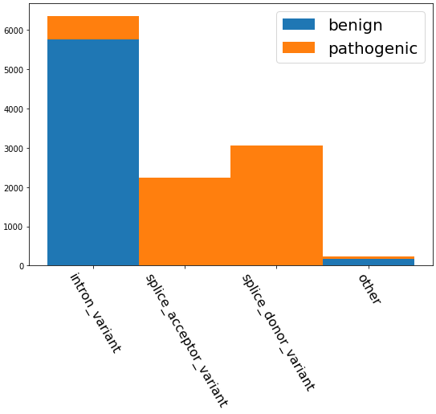

======================
clinvar-snv
======================

 | tags: pathogenicity, variant interpretation, variant effects, perturbation, CADD, SNV

tl;dr
------ 
``clinvar-snv`` (aka cadd-clinvar-snv) is a single-nucleotide variant pathogenicity interpretation task, where models attempt to estimate the likelihood a reference-divergent sequence (i.e. a real, human haplotype) is implicated in a known disease (either germline or somatic). 

overview
--------

``clinvar-snv`` is built on the eponymous ClinVar database, an oft-cited American clinical repository of (historically manual) variant interpretations. Due to intractable combination of longstanding structural issues in health equity, especially with respect to `diversity in genomics`_, and fundamental challenges in sampling size for manually curated (and corroborated) data, GUANinE intentionally declines to provide a training dataset based on ClinVar variants, and instead suggests constructing models by other means, perhaps by using GUANinE's deleteriousness task, cadd-snv (link), as a training proxy. 

The approximate statistical model is :math:`y_{X} \sim \lceil p(X) - p(\tilde{X}) - e\rceil` for  :math:`p` a likelihood of disease incidence over sequences :math:`X` (reference) and :math:`\tilde{X}` (variant); :math:`e` corresponds to a presumable threshold of detectability in terms of severity, medicalization, or social awareness. The ceiling function correspondingly transforms truly/nearly benign divergences from reference (as well as possibly protective effects) to the class of zero, while variants with pathogenic effects exceeding :math:`e` will be rounded upwards to one. 

Class labels are **boolean** and take the form of zero (0, benign) to one (1, pathogenic). Note that this dichotomy, while not entirely false, does not address fundamental issues about the nature of pathogenicity, e.g. variant penetrance, disease incidence, environmental interactions, and homozygosity and its role in allele dominance. 

example models 
--------------
============================  ============
model                         :math:`\rho`
============================  ============
AlphaGenome-K562              **93.1695**
Pangolin                       85.6332
CADD v1.7 (baseline)           84.6379
CADD v1.7 (positional)         83.6767
Naïve consequence type         76.7449
GC-content  (baseline)         11.5278
============================  ============

.. tip::
    models that meet VEP's performance have learned to do more than just detect sequence elements, i.e. they at least partly predict pathogenicity

interpretation
--------------
Variants and variant call files (VCFs) represent one of the most portable, sparsified representations of individual genotypes -- this convenience, along with the historic emphasis on linear, non-epistatic models (including GWAS), has led to a single-variant-centric approach to genetic disease interpretation. 

Of course, no genotype exists outside of its environment (life history, nutrition, social determinants of health, etc), so it should be recognized that models for variant interpretation *in the clinic* are primarily useful in cases of severe, highly penetrant, early-onset conditions and disorders, e.g. the 20th-century use of genetic testing and counseling for carriers of `Tay-sachs disease`_. 

Outside of *clinical* settings, variant interpretation can be immensely more useful for identifying potentially causal pathways, mechanisms, and druggability -- a key pharmaceutical research endeavor.  

.. caution::
    Authors frequently claim their model can 'accurately predict' pathogenicity, but it's worth investigating how they construct their evaluation set. ``GUANinE``, like **every** dataset built on ClinVar, first and foremost measures models' ability to detect specific sequence elements, e.g. splice sites, before measuring pathogenicity. For reference, ``GUANinE``'s ``clinvar-snv`` task has a typical imbalance of variants, as seen below:

example usage
-------------
first, clone the dataset from huggingface (make sure you have ``Git LFS`` installed): ::

    git clone https://huggingface.co/datasets/guanine/clinvar_snv

then, read the file into main memory with your favorite file parser

.. code-block:: python
   :caption: loading with pandas
   
   import pandas as pd

   # there is no training split -- try cadd_snv or external datasets for that
   dev_dat = pd.read_csv('clinvar_snv/bed/dev/dev.bed', sep='\t')
   dev_dat.head()
   

finally, splice the sequence out with your preferred genome reader, e.g. ``twobitreader``

.. code-block:: python
   :caption: accessing sequences with twobitreader

   from twobitreader import TwoBitFile

   # download from https://hgdownload.cse.ucsc.edu/goldenpath/hg38/bigZips/hg38.2bit
   hg38 = TwoBitFile('hg38.2bit')

   CONTEXT_SIZE = 8192 # change for your model, odd numbers simplify centering

   row = dev_dat.iloc[1]
   ch = row['#chr'] 
   st = row['end'] - CONTEXT_SIZE//2 # 'start' for centered models, e.g. 1_001 bp 
   en = row['end'] + CONTEXT_SIZE//2 

   ## if context is even, then variant will be left-center position 
   ref_seq = hg38[f'chr{ch}'][st:en] ## ref allele at (CONTEXT_SIZE-1)//2 = 4095  
   alt_seq = ref_seq[:(CONTEXT_SIZE-1)//2] + row['alt'] + ref_seq[(CONTEXT_SIZE-1)//2+1:]

   # optionally convert to uppercase before tokenizing, etc
   ref_seq, alt_seq = ref_seq.upper(), alt_seq.upper() 
   assert len(ref_seq)==CONTEXT_SIZE # we recommend checking for truncation

build details 
-------------
To harmonize with existing variant interpretation research, clinvar-snv sourced its test set directly from `CADD`_ v1.4 - 1.7, one of the most-publicly-researched deleteriousness (and by correlation, pathogenicity) predictors. ClinVar variants dated from June 2023 were cross-indexed (intersected) with an August 2025 build of ClinVar, ensuring a degree of continuity and assuredness in labels (as a small percentage of variants are reclassified year-to-year). 

Due to the non-coding nature of GUANinE's research emphasis, non-UTR exonic regions (i.e. coding sequences, or 'CDS') were pruned from the data (over half of all SNVs). Intronic variants, and many splicing, transcription, and lncRNA-specific variants are retained (so mRNA-optimized models will likely outperform on certain subsets). 

The remaining 5,982 pathogenic variants in the test set were filtered through `gnomAD v4.1`_, where no variants exceeded a 1\% AF_grpmax across groups in gnomAD (high allele frequency is a common marker for misannotated variants). To control for obvious confounders, and to ensure the dataset's representativeness for rare variant interpretation, the remaining 28,900 benign variants underwent subsampling and distribution alignment via propensity score matching (`PSM`_, using optimal full matching) based on distance to nearest transcription start site (TSS), consequence (e.g. A>G, T>C), and group maximum allele frequency (AF_grpmax) to yield a balanced set of 5,982 benign variants distributed across chromosomes. 

The dev set was sourced from ClinVar variants *not* in CADD's test set (i.e. newly released variants, post-June 2023) and underwent a similar filtration and quality control process. 

controlled factors
-------------------
- G/C content (minimal)
- TSS distance (moderate)
- allele frequency (moderate)
- chromosome distribution (partial) 
- missense variants (heavy)  

appears in
---------------- 
`GUANinE v1.1`_

original citation
-----------------

Melissa J Landrum, Jennifer M Lee, Mark Benson, et al. ClinVar: improving access to variant interpretations and supporting evidence, Nucleic Acids Research, Volume 46, Issue D1, 4 January 2018, Pages D1062–D1067, https://doi.org/10.1093/nar/gkx1153

|

.. _`PSM`: https://en.wikipedia.org/wiki/Propensity_score_matching
.. _`Tay-Sachs disease`: https://en.wikipedia.org/wiki/Tay%E2%80%93Sachs_disease
.. _`ClinVar`: https://www.ncbi.nlm.nih.gov/clinvar/
.. _`diversity in genomics`: https://pmc.ncbi.nlm.nih.gov/articles/PMC5089703/
.. _`gnomAD v4.1`: https://gnomad.broadinstitute.org/
.. _`phyloP`: https://pmc.ncbi.nlm.nih.gov/articles/PMC2798823/
.. _`phyloP100way`: https://hgdownload.soe.ucsc.edu/goldenPath/hg38/phyloP100way/
.. _`GUANinE v1.1`: https://github.com/ni-lab/guanine/404

.. _`CADD`: https://cadd.gs.washington.edu/
